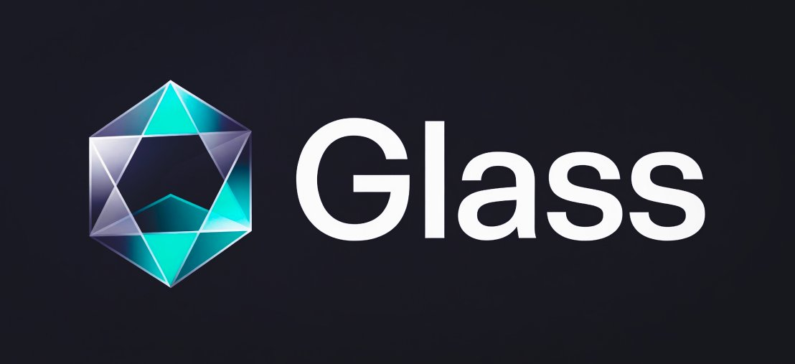

<div align="center">



### A pure functional language designed for transparent local reasoning.

*Every signature tells the truth. Every match is exhaustive. Every effect is declared.*

<br/>

[](CHANGELOG.md)
[](#license)
[](pyproject.toml)
[](tests/test_glass.py)
[](examples/selfhost/prism.glass)

[Quickstart](#quickstart) • [Language tour](docs/language-tour.md) • [Self-hosting](docs/self-hosting.md) • [Spec](LANG.md) • [Changelog](CHANGELOG.md)

</div>

<br/>

```glass
fn average(xs: List<Int>) : Result<Int, String> =
  if len(xs) == 0 then Err("empty list")
  else Ok(fold(xs, 0, fn(a: Int, b: Int) -> a + b) / len(xs))

fn classify(score: Int) : String =
  if score == 100      then "perfect"
  else if score >= 90  then "excellent"
  else if score >= 70  then "good"
  else                      "needs work"

let scores = [98, 85, 100, 67, 91]
match average(scores) {
  Ok(n)  => classify(n);
  Err(e) => e
}
==> "good" : String
```

<br/>

Glass is built around six axioms:

| | |
|---|---|
| **Semantic types over structural** | A name carries meaning. `UserId` and `OrderId` are different types even if both are `Int` underneath. |
| **Immutability with explicit effects** | No hidden mutation. Side effects appear in signatures: `read_file: String -> Result<String, String> !{File}`. |
| **No indexed iteration** | `map`, `filter`, `fold`. Off-by-one errors are removed from the language by construction. |
| **First-class uncertainty** | `Option<A>`, `Result<A, E>`, refinement types. Failure modes are part of the type. |
| **Errors as values** | No exceptions. Every fallible operation returns `Result`. The compiler enforces handling. |
| **Total pattern matching** | `match` is exhaustive. The compiler refuses to compile until every case is covered. |

<br/>

## Stage 3 self-host

The interpreter for Glass is written in Glass.

```bash
$ cat examples/stage3/tiny.glass
type IntList = | INil | ICons(Int, IntList)
fn sum_list(xs: IntList) : Int =
  match xs {
    INil => 0;
    ICons(h, t) => h + sum_list(t)
  }
sum_list(ICons(10, ICons(20, ICons(30, INil))))

$ glass examples/selfhost/prism.glass
...
examples/stage3/tiny.glass  ==>  60 : Int
examples/stage3/poly.glass  ==>  78 : Int
```

That second line is the achievement. `prism.glass` is a 3,984-line Glass program — a full lexer, parser, Hindley-Milner type inferer with effect rows, and tree-walking evaluator. It read both source files from disk via the `read_file` builtin (effect `!{File}`), parsed them, type-checked them, evaluated them, and printed the typed answer.

Two interpretation levels deep, same answers as the host gives directly. **Glass-in-Glass is 6,462 lines — 274% the size of the Python host.**

<br/>

## Install

```bash
git clone https://github.com/EgorKhaklin/Glass.git
cd Glass
pip install -e .
```

Requires Python 3.10+. No other runtime dependencies.

<br/>

## Quickstart

```bash
glass examples/basic/hello.glass
glass examples/basic/fib.glass
glass examples/features/effects.glass
glass examples/selfhost/prism.glass   # the self-host demo
```

Or REPL-style:

```bash
$ glass
glass> let xs = [1, 2, 3, 4, 5]
glass> fold(xs, 0, fn(a, b) -> a + b)
15 : Int
```

<br/>

## Project layout

```
glass/
├── glass.py                  # The host implementation (~2,400 lines, single file)
├── examples/
│   ├── basic/                # hello, fib, lists, options, records
│   ├── features/             # generics, effects, queries, crypto, ai, type inference
│   ├── selfhost/             # prism.glass — Glass written in Glass (3,984 lines)
│   └── stage3/               # tiny.glass, poly.glass — files read by prism.glass
├── tests/
│   └── test_glass.py         # 60/60 regression tests
├── docs/
│   ├── getting-started.md
│   ├── language-tour.md
│   └── self-hosting.md
├── assets/
│   └── glass-logo.png
├── LANG.md                   # Language specification + Stage 3 audit
├── CHANGELOG.md              # v0.0 → v1.0
└── README.md
```

<br/>

## A short tour

**Algebraic data types and exhaustive matching.**

```glass
type Shape =
  | Circle(Float)
  | Rectangle(Float, Float)
  | Triangle(Float, Float, Float)

fn area(s: Shape) : Float =
  match s {
    Circle(r)            => 3.14159 * r * r;
    Rectangle(w, h)      => w * h;
    Triangle(a, b, c)    =>
      let s = (a + b + c) / 2.0 in
      sqrt(s * (s - a) * (s - b) * (s - c))
  }
```

**Generic types.**

```glass
type Tree<A> =
  | Leaf
  | Node(A, Tree<A>, Tree<A>)

fn map_tree<A, B>(t: Tree<A>, f: (A) -> B) : Tree<B> =
  match t {
    Leaf => Leaf;
    Node(v, l, r) => Node(f(v), map_tree(l, f), map_tree(r, f))
  }
```

**Effects in signatures.**

```glass
fn read_config(path: String) : Result<Config, String> !{File} =
  match read_file(path) {
    Ok(content) => parse_config(content);
    Err(msg)    => Err("could not read config: " ++ msg)
  }
```

Calling `read_config` anywhere in your program means `!{File}` shows up in the calling function's signature too. The effect system tracks side effects through the call graph — no hidden I/O.

**Result monad chaining.**

```glass
fn pipeline(input: String) : Result<Int, String> =
  bind_result(parse(input), fn(ast) ->
    bind_result(typecheck(ast), fn(typed) ->
      bind_result(evaluate(typed), fn(value) ->
        Ok(value))))
```

See [`docs/language-tour.md`](docs/language-tour.md) for the full tour.

<br/>

## What's in here

| File | What it is |
|------|------------|
| [`glass.py`](glass.py) | The Python implementation — lexer, parser, HM-with-effects inferer, evaluator. ~2,400 lines, single file. |
| [`examples/selfhost/prism.glass`](examples/selfhost/prism.glass) | **The Glass-in-Glass implementation.** Full pipeline written in Glass: 3,984 lines. |
| [`examples/selfhost/eff_infer.glass`](examples/selfhost/eff_infer.glass) | Standalone Hindley-Milner with effect rows: 787 lines. |
| [`examples/selfhost/infer.glass`](examples/selfhost/infer.glass) | Standalone HM (no effects): 552 lines. |
| [`examples/selfhost/typecheck.glass`](examples/selfhost/typecheck.glass) | Monomorphic type checker: 361 lines. |
| [`examples/selfhost/bootstrap.glass`](examples/selfhost/bootstrap.glass) | source → value pipeline: 481 lines. |
| [`examples/selfhost/mini.glass`](examples/selfhost/mini.glass) | Closure-based interpreter for a small expression language: 168 lines. |
| [`LANG.md`](LANG.md) | Language specification + Stage 3 self-host audit. |
| [`CHANGELOG.md`](CHANGELOG.md) | Version history from v0.0 through v1.0. |

<br/>

## Design philosophy

Glass is built on the premise that **a programming language should make the next reader's job easy**.

Most languages optimize for the writer in the moment of writing. They allow shortcuts, implicit conversions, hidden state, and undeclared side effects because those things make typing faster. Glass refuses these. Every signature must tell the truth. Every match must cover every case. Every effect must be declared. The compiler is a guarantor of transparent local reasoning.

The cost is verbosity. The benefit is that six months later, when you come back to a file you don't remember writing, you can read a function's signature and understand exactly what it does, what it can fail on, and what it touches in the world.

<br/>

## Status

| Milestone | Status |
|---|---|
| Core language (ADTs, generics, HM types, pattern matching, effects) | ✓ v1.0 |
| Self-hosting Stage 3 (prism.glass interprets `.glass` files from disk) | ✓ v1.0 |
| Refinement types (full integration) | partial — v1.1 |
| Quartz: native compiler back-end | planned — v2.0 |
| Pane: query layer | planned — v2.x |
| Frost: ZK extension of Pane | planned — v3.0 |

<br/>

## License

Glass is dual-licensed under either of:

- **MIT License** ([LICENSE-MIT](LICENSE-MIT) or <https://opensource.org/licenses/MIT>)
- **Apache License, Version 2.0** ([LICENSE-APACHE](LICENSE-APACHE) or <https://www.apache.org/licenses/LICENSE-2.0>)

at your option. This is the same pattern used by Rust and most of the modern compiler ecosystem: MIT for simplicity and broad compatibility, Apache 2.0 for the explicit patent grant.

### Contribution

Unless you explicitly state otherwise, any contribution intentionally submitted for inclusion in Glass by you, as defined in the Apache-2.0 license, shall be dual-licensed as above, without any additional terms or conditions.

<br/>

<div align="center">

*Glass v1.0 — built on the principle that constraints can be load-bearing.*

</div>
