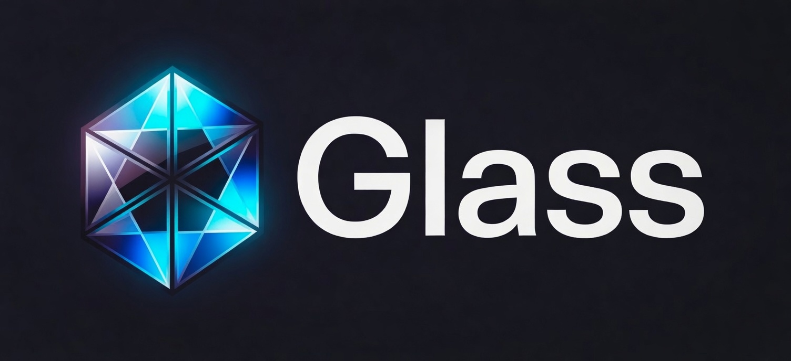

<div align="center">




### You can see straight through it.

[](https://github.com/EgorKhaklin/Glass/actions/workflows/tests.yml)
[](tests/test_glass.py)
[](docs/self-hosting.md)
[](LICENSE)

</div>

<br/>

A functional language where every signature tells the **whole truth**: what it
takes, what it returns, what it touches, how it can fail. Read one function and
you know exactly what it does. Nothing hidden. Nothing implicit. Like glass.

And that single idea — *transparency* — turns out to go further than anyone expects.

<br/>

> ### It tells the truth.
> Honest signatures. Exhaustive matches. Effects you must declare. The compiler
> enforces that you can reason about any function by reading it and only it.
>
> ### It compiles itself.
> Glass's compiler is **written in Glass**, and reproduces itself byte-for-byte
> with no other language in the loop. A language honest about what code does is
> honest enough to stand on its own.
>
> ### It proves itself.
> Built from scratch, in Glass: a **zero-knowledge prover**. Commit a private
> dataset, ask it a question — *the total payroll, the headcount, the average
> salary* and get back a cryptographic proof of the answer that reveals the
> commitment, the query, the result, and **not a single row**.

<br/>

One principle, from a type signature all the way to a zero-knowledge proof:
**you should never have to take the code's word for it.**

→ **[Read the whole story, end to end](docs/the-story.md)** — every claim a command you can run.

<br/>

```glass
# The signature is the entire contract: this returns EITHER an answer OR an
# error, and the type system makes the caller handle both. No silent failure,
# no exception, no surprise — the function can't do anything the type doesn't say.

fn safe_divide(a: Int, b: Int) : Result<Int, String> =
  if b == 0 then Err("cannot divide by zero")
  else Ok(a / b)

match safe_divide(42, 6) {
  Ok(n)  => print("result: " ++ int_to_string(n));
  Err(e) => print("error: " ++ e)
}
```

<br/>

## Try it

```bash
git clone https://github.com/EgorKhaklin/Glass.git
cd Glass
pip install -e .            # Python 3.10+, no other dependencies

glass examples/basic/hello.glass
glass examples/prove/prove_pane.glass   # prove queries over a private table, revealing no rows
glass                        # or start the REPL
```

Prefer the browser? `python -m http.server` and open
[`playground.html`](playground.html) — Glass runs fully client-side, no install.

<br/>

## Where to go

| If you want to… | Go here |
|---|---|
| **Learn the language** | [A tour](docs/language-tour.md) · [Getting started](docs/getting-started.md) · [the spec](LANG.md) |
| **See what it can express** | [`examples/showcase/`](examples/showcase/) |
| **Watch Glass compile itself** | [Self-hosting](docs/self-hosting.md) · [`examples/selfhost/`](examples/selfhost/) |
| **See the zero-knowledge prover** | **[Frost — a zk-STARK in Glass](examples/frost/)** · [write Glass, get a proof](examples/prove/) |
| **Prove a query over private data** | **[Pane ⊕ Frost — the founding payoff](examples/prove/prove_pane.glass)** · [in zero-knowledge](examples/prove/prove_query_zk.glass) |
| **Read the whole story** | [Glass, end to end](docs/the-story.md) |
| **Know where it's headed** | [Roadmap](docs/roadmap.md) |
| **Read every example** | [`examples/`](examples/) |

<br/>

## What's in here

```
glass/
├── glass.py          # the language — parser, type checker, interpreter (one file)
├── quartz.py         # the native back end — Glass → C
├── examples/         # everything below runs with `glass <file>`
│   ├── basic/  features/  showcase/  lib/   ·  learn the language
│   ├── selfhost/  quartz/  stage3/          ·  Glass compiling Glass
│   └── pane/  frost/  prove/                ·  built in Glass: a query language, a
│                                                zk-STARK, and a bridge from source to proof
├── docs/             # tour, spec, self-hosting, roadmap
├── tests/            # the regression suite (381/381)
└── playground.html   # browser playground (Pyodide)
```

<br/>

## Status

Glass is a research language and a labor of love. It self-hosts, ships 381
passing tests, runs in the browser, and is the foundation for the experiments
in [`examples/frost/`](examples/frost/) and [`examples/prove/`](examples/prove/).
It is not production-hardened, and it doesn't pretend to be. See the honest
notes throughout.

## License

Dual-licensed under [MIT](LICENSE-MIT) or [Apache 2.0](LICENSE-APACHE), your choice.
