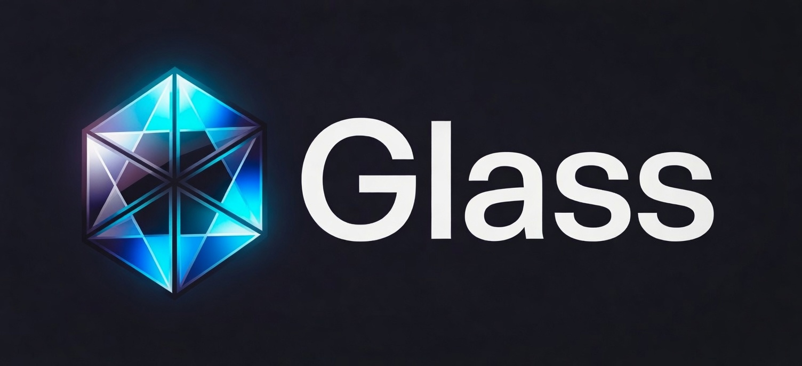

<div align="center">




### You can see straight through it.

[](https://github.com/EgorKhaklin/Glass/actions/workflows/tests.yml)
[](tests/test_glass.py)
[](docs/self-hosting.md)
[](pentecost/)
[](LICENSE)

</div>

<br/>

Now a machine writes the code.

You describe what you want; it generates the structure. It runs, it reads
cleanly, it passes the demo and you are asked to trust it. The hard part was
never the typing. It was the trust. Underneath the plausible surface: a side
effect nobody declared, a branch never handled, a function that does more than
its name admits. And the plausible now ships faster than anyone can read it.

Glass refuses the asking.

Let the structure be generated — by you, by a model, by anyone. Glass does not
ask where it came from. It asks only that the truth about it stay visible, and
visible means machine-checkable, not merely plausible.

> Looks right is not the same as is right. One can be generated. The other has
> to be reconstructed.

So nothing is left implicit. Every signature states what a function takes,
returns, touches, and how it fails — declared, not discovered at runtime. A
function can't touch, return, or fail in any way its signature doesn't admit.
Effects are declared or they don't compile. Matches are exhaustive. Failure is a
value the caller must face, never a silent surprise. None of this is taken on
faith; it's checked, by the compiler, on every program, today.

You don't audit the intention. You audit what's *there* — and what's there has
nowhere left to hide.

Generated or written, one rule does not bend: you should never have to take the
code's word for it.

It tells the truth. It reconstructs itself. It proves what happened — and lets
the proof be checked by something other than itself. The first you have just
read; the rest it shows you below.

<br/>

> ### It reconstructs itself.
> Glass's compiler is **written in Glass**, and rebuilds itself byte-for-byte —
> two independently-produced native compilers emit identical C, with no other
> language left in the loop. And the discipline runs deeper than that:
> every layer is computed *two independent ways* — a reference meaning and a
> compiled one — and forced to agree to the last bit. The instant the two
> reconstructions diverge, it's a desync, and the build stops. A system you can
> replay and check against itself, where no divergence slips past unnoticed.
>
> ### It proves what happened.
> Built from scratch, in Glass: a **zero-knowledge prover**. Commit a private
> dataset, ask it a question — *the total payroll, the headcount, and from a
> proven sum and count, the average* — and get back a cryptographic proof of the
> answer that reveals the commitment, the query, the result, and **not a single
> row**.
>
> Then it closes the loop: **write a Glass function — arithmetic, comparisons,
> calls, recursion — and get a zero-knowledge proof of its result**, over the
> production **Goldilocks** field that real provers use (the default for `glass
> prove`; a toy Baby Bear field adds full `match`-over-your-own-types for
> teaching). The prover is a from-scratch STARK — field, Poseidon hash, Merkle
> trees, FRI, blinding. You write what a program *means*; you get a
> machine-checkable proof it ran exactly as written.
>
> ### And it's checked twice.
> A proof you can't independently check is just a promise. So the verifier is
> **two**: a second, from-scratch re-implementation — a different language, a
> different number representation, sharing **no code** with the prover —
> re-derives every challenge and re-checks the proof. Emit it on one side
> (`glass prove --emit`), verify it on the other (`glass verify`) — separate
> programs, separate lineages, one verdict that must agree. And when the prover
> can't faithfully turn a program into a circuit, it says so (**ABSTAIN**) rather
> than bluff an answer. A thousand-plus tampered and forged proofs have been
> thrown at the second verifier; every one was rejected.
>
> It is a from-scratch demonstration, not audited cryptography — what a proof here
> does and does not guarantee is written down in full in
> [the soundness ledger](docs/soundness.md).

<br/>

Run it once, then run it again through the other implementation: reference and
compiled must meet at every bit. Ask it what a function computed, and it answers
with a proof — the result, and nothing it was built from. One principle runs the
whole distance, from a type signature to a zero-knowledge proof. It was the rule
from the first line:
**you should never have to take the code's word for it.**

→ **[Read the whole story, end to end](docs/the-story.md)** — every claim a command you can run.

<br/>

```glass
# The signature is the entire contract: this returns EITHER an answer OR an
# error, and the type system makes the caller handle both. No silent failure,
# no exception, no surprise — the function can't do anything the type doesn't say.

fn safe_divide(a: Int, b: Int) : Result<Int, String> =
  if b == 0 then Err("cannot divide by zero")
  else Ok(a / b)

match safe_divide(42, 6) {
  Ok(n)  => print("result: " ++ int_to_string(n));
  Err(e) => print("error: " ++ e)
}
```

<br/>

## Try it

```bash
git clone https://github.com/EgorKhaklin/Glass.git
cd Glass
pip install -e .            # Python 3.10+ — no deps for the interpreter
                            # (the native compiler also needs cc + libgc; see docs/getting-started.md)

glass examples/basic/hello.glass
glass examples/prove/prove_pane.glass   # prove queries over a private table, revealing no rows
glass                        # or start the REPL

# Prove a function's result, then check the proof with the INDEPENDENT verifier:
glass prove --emit /tmp/p.txt examples/prove/hello_prove.glass inp=9
glass verify /tmp/p.txt                 # -> PENTECOST: ACCEPT  (a separate program, no shared code)
```

Prefer the browser? `python -m http.server` and open
[`playground.html`](playground.html) — Glass runs fully client-side, no install.

<br/>

## Where to go

| If you want to… | Go here |
|---|---|
| **Learn the language** | [A tour](docs/language-tour.md) · [Getting started](docs/getting-started.md) · [the spec](LANG.md) |
| **See what it can express** | [`examples/showcase/`](examples/showcase/) |
| **Watch Glass reconstruct itself** | [Self-hosting](docs/self-hosting.md) · [`examples/selfhost/`](examples/selfhost/) |
| **See the zero-knowledge prover** | **[Frost — a zk-STARK in Glass](examples/frost/)** · [write Glass, get a proof](examples/prove/) |
| **Prove a query over private data** | **[Pane ⊕ Frost — the founding payoff](examples/prove/prove_pane.glass)** · [in zero-knowledge](examples/prove/prove_query_zk.glass) |
| **See a proof checked independently** | **[Pentecost — let the verifier be two](pentecost/)** · [`glass prove --emit` → `glass verify`](pentecost/README.md) |
| **Read the whole story** | [Glass, end to end](docs/the-story.md) |
| **Know what a proof here really guarantees** | [Soundness — the honest ledger](docs/soundness.md) |
| **Know where it's headed** | [Roadmap](docs/roadmap.md) |

<br/>

## What's in here

```
glass/
├── glass.py          # the language — parser, type checker, interpreter (one file)
├── quartz.py         # the native back end — Glass → C
├── examples/         # everything below runs with `glass <file>`
│   ├── basic/  features/  showcase/  lib/   ·  learn the language
│   ├── selfhost/  quartz/  stage3/          ·  Glass compiling Glass
│   └── pane/  frost/  prove/                ·  built in Glass: a query language, a
│                                                zk-STARK, and a bridge from source to proof
├── pentecost/        # a second, independent verifier — every proof checked twice
├── name/ ledger/ seal/   # content-addressed identity · append-only verdict ledger · selective disclosure
├── fuzz/             # soundness fuzzers — random + adversarial tamper/claim campaigns
├── docs/             # tour, spec, self-hosting, soundness, roadmap
├── tests/            # the regression suite (475/475)
└── playground.html   # browser playground (Pyodide)
```

<br/>

## Status

Glass is a research language and a labor of love. It self-hosts, ships 422
passing tests, runs in the browser, proves the result of a function and has that
proof re-checked by a second independent verifier, and is the foundation for the
experiments in [`examples/frost/`](examples/frost/) and [`examples/prove/`](examples/prove/).
It is not production-hardened, and it doesn't pretend to be: every claim above is
a command you can run, and every limit is written down plainly — start with the
[soundness ledger](docs/soundness.md). Nothing taken on faith, including the faith
you'd place in it.

## License

Dual-licensed under [MIT](LICENSE-MIT) or [Apache 2.0](LICENSE-APACHE), your choice.
