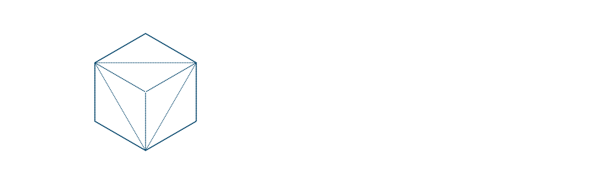

<div align="center">

<picture>
  <source media="(prefers-color-scheme: dark)" srcset="assets/glass-dark.svg">
  
</picture>

**A verifiable language that compiles itself. Every proof it makes is judged three ways.**

[](https://github.com/EgorKhaklin/Glass/actions/workflows/tests.yml)
[](https://github.com/EgorKhaklin/Glass/releases/latest)
[](docs/compiler/self-hosting.md)
[](#status)
[](LICENSE)

</div>

<picture><source media="(prefers-color-scheme: dark)" srcset="assets/rule-dark.svg"></picture>

Now a machine writes the code. It reads cleanly, it passes the demo, and you are asked to trust it.

Glass refuses the asking. Let the structure be generated by you, by a model, by anyone. Glass asks only that the truth about it stay visible, and visible means checked by a machine, not merely plausible.

- **It tells the truth.** A signature states what a function takes, returns, touches, and how it fails. Effects are declared or the program does not compile. Matches are exhaustive. Failure is a value the caller must face.
- **It reconstructs itself.** The compiler is written in Glass and rebuilds itself to byte-identical C. Each layer is computed two independent ways, and the build stops the instant they disagree.
- **It proves what happened.** Write a function and get a proof of its result. The proof is judged by three checkers that share no code.

> Looks right is not the same as is right. One can be generated. The other has to be reconstructed.

```glass
fn safe_divide(a: Int, b: Int) : Result<Int, String> =
  if b == 0 then Err("cannot divide by zero")
  else Ok(a / b)

match safe_divide(42, 6) {
  Ok(n)  => print("result: " ++ int_to_string(n));
  Err(e) => print("error: " ++ e)
}
```

<picture><source media="(prefers-color-scheme: dark)" srcset="assets/rule-dark.svg"></picture>

## Try it

```bash
git clone https://github.com/EgorKhaklin/Glass.git && cd Glass
pip install -e .                     # Python 3.10+, no dependencies
glass examples/basic/hello.glass     # run a program
glass                                # or open the REPL
```

Proving compiles to native code, so it also needs a C compiler and the Boehm GC (`libgc`). See [getting started](docs/language/getting-started.md).

```bash
# Prove f(inp) = 86 for an input you keep, and re-execute the source as a cross-check
glass prove --cross-check examples/prove/hello_prove.glass inp=9

# Prove a key starts with "sk-live-"; add --zk so the proof hides the key
glass prove --zk examples/prove/private_prefix.glass key=sk-live-9f3a2c7e1b

# Emit a portable proof and check it with Lens, the independent verifier
glass prove --emit /tmp/p.txt examples/prove/hello_prove.glass inp=9
glass verify /tmp/p.txt              # LENS: ACCEPT

# A false claim fails: 17 / 5 is 3, not 4
echo 'a / b' > /tmp/div.glass
glass prove --claim 4 /tmp/div.glass a=17 b=5     # REJECT, exit 2
```

The verdict is the exit code: `0` accept, `1` abstain, `2` reject, `3` cross-check divergence. A script can never mistake a disproof for success.

<picture><source media="(prefers-color-scheme: dark)" srcset="assets/rule-dark.svg"></picture>

## How a proof is judged

| Judge | What it is | What it catches |
|---|---|---|
| `verify_b3` | A witness-free STARK verifier, written in Glass, that re-derives every Fiat-Shamir challenge | A proof that does not satisfy its circuit |
| [Lens](lens/) | A second verifier, written from scratch in Python, sharing no code with the prover | A bug in the first verifier |
| Cross-check | The reference interpreter re-executes your source on the same inputs | A compiler that lowered your program to the wrong circuit |

When Glass cannot lower a program faithfully, it abstains, loudly and with a reason, instead of proving something else. The test suite runs a deliberately malicious prover, and its forged proof must be rejected for the build to pass.

<picture><source media="(prefers-color-scheme: dark)" srcset="assets/rule-dark.svg"></picture>

## Status

Glass 1.0.0 is research software. What each part can be trusted for:

- **The language is real and general.** Hindley-Milner inference, declared effects, refinement types, exhaustive matching, linear types, modules.
- **Self-hosting is real and specific.** Two generations of the native compiler emit byte-identical C, and [the fingerprint](fingerprint/) binds the compiler, prover, verifiers, tests, and spec into one Poseidon-Merkle root. It catches divergence between implementations, not every error.
- **The prover is narrow and unaudited.** It proves the result of a function over a subset of the language (arithmetic, comparisons, division, signed integers, strings, records, bounded recursion, higher-order calls) on the Goldilocks field with Poseidon2. Soundness is about 80 bits provable and about 135 bits under a standard conjecture. Default proofs are sound but not zero-knowledge; `--zk` adds hiding. It was written from scratch and has not been audited. **Do not protect real value with it.** The full ledger is in [soundness](docs/security/soundness.md) and [SECURITY.md](SECURITY.md).

The next stage moves proving onto an audited backend, with Frost, the from-scratch prover, kept as the readable reference. See the [roadmap](docs/roadmap.md).

## Where to go

| To | Read |
|---|---|
| Learn the language | [The tour](docs/language/tour.md) · [Getting started](docs/language/getting-started.md) · [The spec](LANG.md) |
| See what it can express | [`examples/showcase/`](examples/showcase/) |
| Watch it rebuild itself | [Self-hosting](docs/compiler/self-hosting.md) |
| Read the prover | [Frost, a zk-STARK in Glass](examples/frost/) · [From source to proof](examples/prove/) |
| Know what a proof guarantees | [Soundness](docs/security/soundness.md) · [SECURITY.md](SECURITY.md) |
| Audit it | [Audit readiness](docs/security/audit-readiness.md) |
| See what comes next | [Roadmap](docs/roadmap.md) |

## Layout

```
glass.py        the language: parser, type checker, interpreter
quartz.py       the native back end: Glass to C
examples/       basic, features, showcase, lib     the language
                selfhost, quartz, stage3            Glass compiling Glass
                frost, pane, prove                  a zk-STARK, a query language, source to proof
lens/           the independent verifier
fingerprint/    one Poseidon-Merkle root over the core
ledger/         an append-only ledger of proof verdicts
disclose/       selective disclosure over a commitment
fuzz/           soundness fuzzers and tamper campaigns
docs/           language, compiler, security, roadmap
tests/          the regression suite
```

Its sibling, [Tiresias](https://github.com/EgorKhaklin/tiresias), answers aggregate questions over data it never reveals; it proves with the audited RISC Zero zkVM while Glass's own backend is built.

## License

[MIT](LICENSE-MIT) or [Apache 2.0](LICENSE-APACHE), at your option.
